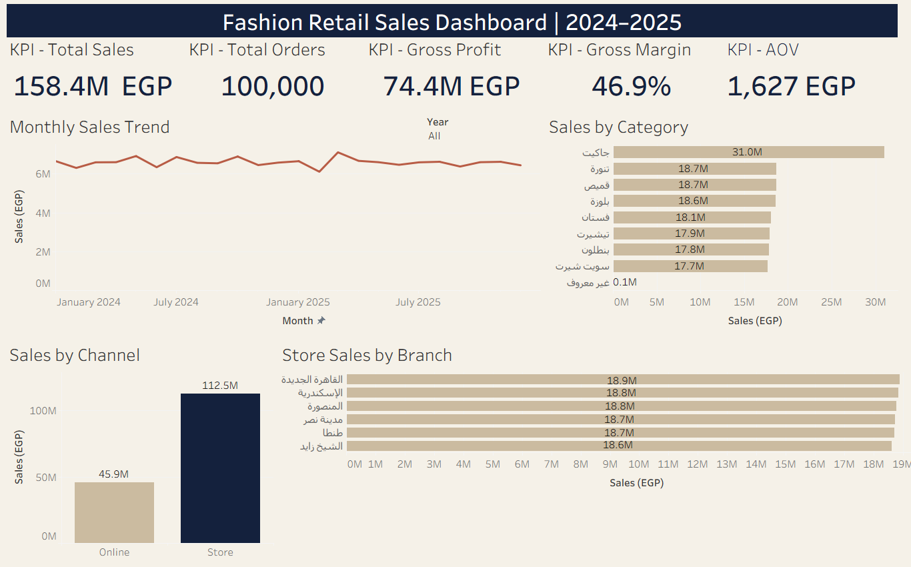

# Fashion Retail Analytics | 2024–2025

مشروع Portfolio متكامل لتحليل مبيعات متجر ملابس مصري افتراضي يعمل من خلال
الفروع وOnline Channel خلال عامي 2024 و2025.

المشروع يوضح رحلة البيانات كاملة بدايةً من تحميل CSV Files باستخدام Python،
مرورًا بالتنظيف وبناء Analytics Model داخل PostgreSQL، وحتى إنشاء Interactive
Dashboard باستخدام Tableau.



## Project Objective | هدف المشروع

الهدف هو بناء Data Pipeline موثوقة تجمع Store Sales وOnline Sales وتجيب عن
الأسئلة التالية:

- ما اتجاه Sales وProfitability خلال الوقت؟
- أي Sales Channel يحقق مبيعات أعلى؟
- ما أفضل Product Categories وStore Branches؟
- كيف تؤثر مشكلات Data Quality على دقة التقارير؟
- ما قيم KPIs الأساسية مثل Total Sales وGross Profit وAOV؟

## Technology Stack | الأدوات المستخدمة

- **Python:** تحميل CSV Files إلى قاعدة البيانات بشكل آلي.
- **PostgreSQL:** تخزين البيانات وبناء طبقات Raw وClean وAnalytics.
- **SQL:** فحص الجودة، إزالة التكرار، توحيد القيم، وحساب المقاييس.
- **Tableau:** إنشاء Dashboard تفاعلية وعرض Business Insights.

## Data Pipeline | مسار البيانات

```text
CSV Files → Python → PostgreSQL Raw → SQL Cleaning → Analytics Views → Tableau
```

قاعدة البيانات مقسمة إلى ثلاث طبقات:

1. **Raw Schema:** تحتفظ بالبيانات الأصلية كما وصلت دون تعديل.
2. **Clean Schema:** تنظف الأخطاء والتكرار وتوحّد الصيغ.
3. **Analytics Schema:** تجهز جداول واضحة للاستخدام في التحليل وTableau.

## Dashboard KPIs | مؤشرات الأداء

| KPI | Result |
|---|---:|
| Total Sales | 158.4M EGP |
| Total Orders | 100,000 |
| Gross Profit | 74.4M EGP |
| Gross Margin | 46.9% |
| Average Order Value | 1,627 EGP |
> **AOV Note:** يتم حساب Average Order Value باستخدام Recognized Orders فقط، مع استبعاد الطلبات الملغاة أو التي لم تكتمل.

## Key Insights | أهم النتائج

- حققت الفروع حوالي **112.5M EGP** مقابل **45.9M EGP** للـOnline Channel.
- كانت **Jackets** أعلى Category بمبيعات حوالي **31.0M EGP**.
- كانت مبيعات الفروع الستة متقاربة، بحوالي **18.6M–18.9M EGP** لكل فرع.
- حافظت Monthly Sales على مستوى مستقر نسبيًا حول **6M–7M EGP**.

## Data Quality Work | معالجة جودة البيانات

تضمنت Source Data مشكلات واقعية، منها:

- Mixed Date Formats.
- Duplicate Sales Lines وDuplicate Shipments.
- اختلاف أسماء وأكواد الفروع.
- Monetary Values تحتوي على فواصل أو كلمة `EGP`.
- اختلاف كتابة Product Colors وSizes.
- Egyptian Phone Numbers مكتوبة بأكثر من صيغة.
- وجود أكثر من Customer Record لنفس الشخص.
- Invalid References في عدد محدود من Return Records.
- أسماء محافظات مكتوبة بالعربي والإنجليزي.

تم تجميع خطوات التنظيف في 6 Views مفهومة، واستخدام CTEs للمراحل المؤقتة بدل
إنشاء عدد كبير من Intermediate Views.

## Simplified Data Model | النموذج المبسط

### Cleaning Views

- `clean.branches`
- `clean.products`
- `clean.customers`
- `clean.store_sales`
- `clean.online_sales`
- `clean.returns`

### Analytics Views

- `analytics.dim_date`
- `analytics.dim_customers`
- `analytics.dim_products`
- `analytics.dim_locations`
- `analytics.fact_sales_analysis`

يعتبر `analytics.fact_sales_analysis` هو Final Fact View المستخدم بشكل أساسي
في Tableau، وتدعمه Dimensions الخاصة بالتاريخ والعملاء والمنتجات والفروع.

## Project Structure | هيكل المشروع

```text
Fashion-Retail-Analytics/
├── dashboard/
│   ├── dashboard_final.png
│   └── Fashion_Retail_Analytics_Final.twbx
├── data/
│   └── README.md
├── documentation/
│   └── project_walkthrough_ar.md
├── python/
│   └── load_csv_to_postgres.py
├── sql/
│   ├── 01_data_quality_checks.sql
│   ├── 02_cleaning_views.sql
│   └── 03_analytics_model.sql
└── README.md
```

## How to Explore | طريقة مراجعة المشروع

1. ابدأ بملف `documentation/project_walkthrough_ar.md` لفهم المشروع بالعربي.
2. راجع SQL Files بالترتيب الرقمي لفهم الفحص والتنظيف والتحليل.
3. افتح Tableau Packaged Workbook الموجود داخل فولدر `dashboard`.
4. استخدم Filters لتحليل النتائج حسب السنة والقناة والتصنيف والفرع.

## Data Availability | ملفات البيانات

Original CSV Files غير مرفوعة بسبب حجمها. أسماء الملفات المطلوبة موضحة داخل
`data/README.md`. يركز الـRepository على Data Pipeline وSQL Logic وAnalytics
Model والـDashboard النهائية.

## Project Scope | نطاق المشروع

هذا **Self-Directed Training & Portfolio Project** يهدف إلى تطبيق End-to-End
Analytics Workflow. المشروع لا يمثل خبرة عمل فعلية داخل متجر حقيقي.

## Author

**Ahmed Samir Toukhy Ahmed**

- GitHub: [ahmedtoukhy13](https://github.com/ahmedtoukhy13)
